-   [LexisPlotR](#lexisplotr)
    -   [Installation](#installation)
    -   [What is a Lexis Diagram?](#what-is-a-lexis-diagram)
    -   [Using LexisPlotR](#using-lexisplotr)
        -   [Plot an empty Lexis grid](#plot-an-empty-lexis-grid)
        -   [Highlight certain areas of the Lexis grid](#highlight-certain-areas-of-the-lexis-grid)
        -   [Add life lines to the Lexis Diagram](#add-life-lines-to-the-lexis-diagram)
        -   [Use data from the Human Mortality Database](#use-data-from-the-human-mortality-database)
    -   [Everything is a ggplot2 object](#everything-is-a-ggplot2-object)
    -   [If you ...](#if-you-...)

<!-- README.md is generated from README.Rmd. Please edit that file -->
LexisPlotR
==========

[](http://cran.rstudio.com/package=LexisPlotR) [](http://www.r-pkg.org/pkg/LexisPlotR)

**`LexisPlotR`** is a tool to easily plot Lexis Diagrams within R. It is based on [`ggplot2`](https://github.com/hadley/ggplot2) and wraps necessary steps like drawing the grid, highlighting certain areas or inserting lifelines in a couple of easy to use functions.

Installation
------------

You can install the latest version of **`LexisPlotR`** (v0.3.2) by using `install_github()` from the `devtools`-package:

    devtools::install_github("ottlngr/LexisPlotR")
    library(LexisPlotR)

**`LexisPlotR`** (v0.3) is available on CRAN. Install v0.3 from CRAN:

    install.packages("LexisPlotR")
    library(LexisPlotR)

What is a Lexis Diagram?
------------------------

> In demography a Lexis diagram (named after economist and social scientist Wilhelm Lexis) is a two dimensional diagram that is used to represent events (such as births or deaths) that occur to individuals belonging to different cohorts. Calendar time is usually represented on the horizontal axis, while age is represented on the vertical axis. (<https://en.wikipedia.org/wiki/Lexis_diagram>)

Using LexisPlotR
----------------

**`LexisPlotR`** provides a couple of functions to draw Lexis Diagrams in R. Besides the ability to draw empty Lexis grids, **`LexisPlotR`** also offers some functionality to highlight certain areas of the grid or to add actual data to the Lexis Diagram.

### Plot an empty Lexis grid

> In September 2016 (v0.3.2), `lexis.grid2()` was introduced to add functionality some users missed in `lexis.grid()`. I highly recommend to use `lexis.grid2()` instead of `lexis.grid()` for most tasks.

A Lexis Diagram is basically determined by two measures: A range of years presented on the horizontal axis and a range of ages shown on the vertical axis. To plot an empty Lexis grid, use `lexis.grid()` which takes these measures as numeric inputs:

``` r
library(LexisPlotR)
```

``` r
# Plot a Lexis grid from year 1900 to year 1905, representing the ages from 0 to 5
lexis.grid2(year.start = 1900, year.end = 1905, age.start = 0, age.end = 5)
```

    ## Warning: Ignoring unknown aesthetics: x, y

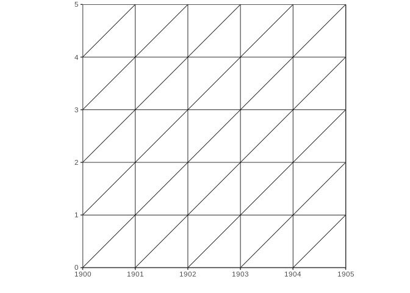

The aspect ratio of the axes is fixed to ensure right-angled triangles. So even non-square Lexis grids show right-angled triangles:

``` r
lexis.grid2(year.start = 1900, year.end = 1905, age.start = 0, age.end = 7)
```

    ## Warning: Ignoring unknown aesthetics: x, y

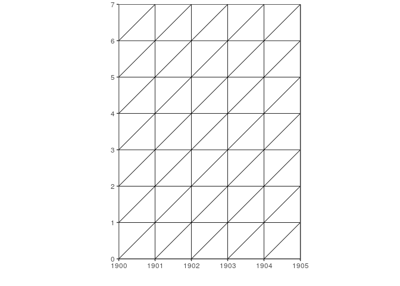

Lexis Diagrams with a wide age and/or date range may look odd:

``` r
lexis.grid2(year.start = 1900, year.end = 1950, age.start = 0, age.end = 50)
```

    ## Warning: Ignoring unknown aesthetics: x, y

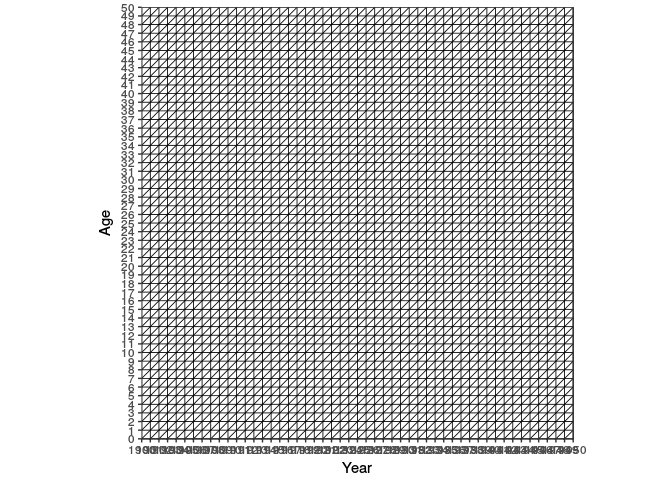

One way to improve the appearance of such big plots, one can alter the linewidth of the grid using the `lwd` parameter:

``` r
lexis.grid2(year.start = 1900, year.end = 1950, age.start = 0, age.end = 50, lwd = 0.1)
```

    ## Warning: Ignoring unknown aesthetics: x, y

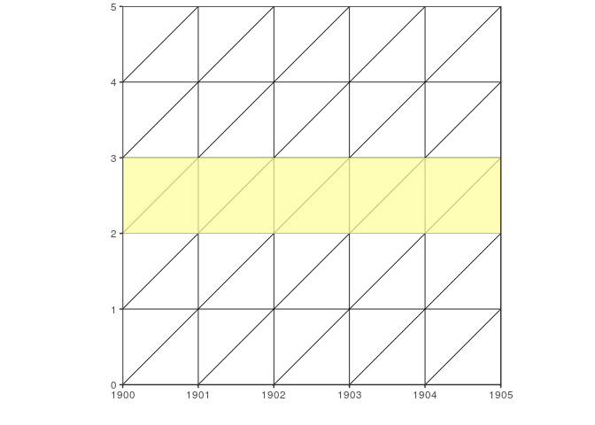

A better option is to use age groups to achieve less grid lines. Use the `d` parameter:

``` r
lexis.grid2(year.start = 1900, year.end = 1950, age.start = 0, age.end = 50, d = 5)
```

    ## Warning: Ignoring unknown aesthetics: x, y

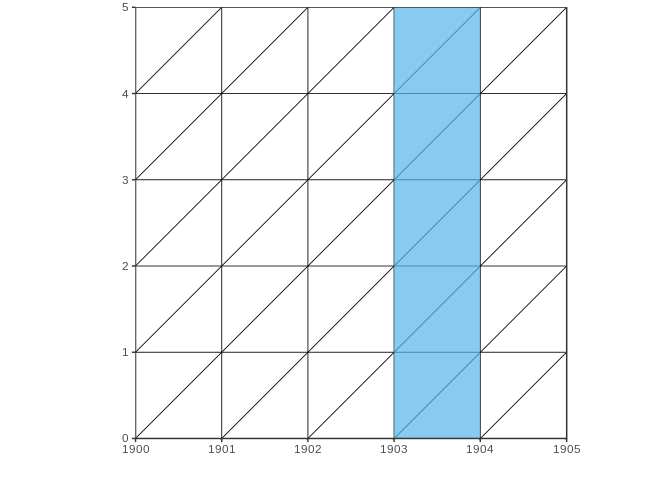

### Highlight certain areas of the Lexis grid

Sometimes it is useful to highlight certain areas in the Lexis Diagram, like a certain age, year or cohort. Highlighting a certain age in your grid is supported by `lexis.age` which will draw a coloured rectangle inside your grid marking all points in the grid belonging to a certain age group.

First, define an empty Lexis grid with the desired dimensions:

``` r
mylexis <- lexis.grid2(year.start = 1900, year.end = 1905, age.start = 0, age.end = 5)
```

    ## Warning: Ignoring unknown aesthetics: x, y

``` r
mylexis
```

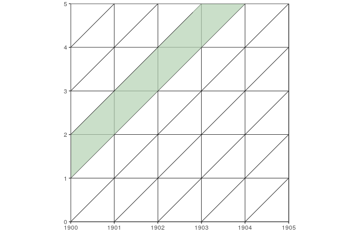

You can now use `lexis.age()` to add a coloured layer to that Lexis grid:

``` r
# Highlight all points that belong to the age of 2
lexis.age(lg = mylexis, age = 2)
```

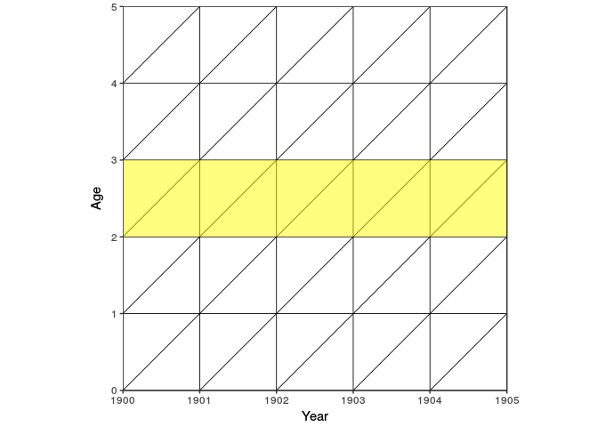

The default fill colour for `lexis.age()` is `"yellow"`, but you can change the colour as well as the level of transparency:

``` r
# Change the fill colour to "red" and make the layer nearly non-transparent
lexis.age(lg = mylexis, age = 2, fill = "red", alpha = 0.8)
```

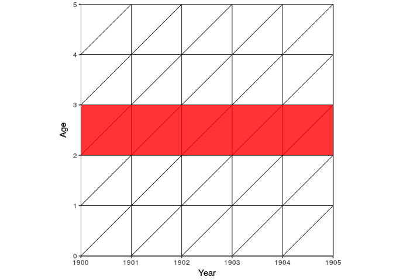

`lexis.year()`, which highlight a certain year, and `lexis.cohort()`, which does the same thing for a desired cohort, work nearly the same:

``` r
# Highlight the year 1902
lexis.year(lg = mylexis, year = 1902)
```

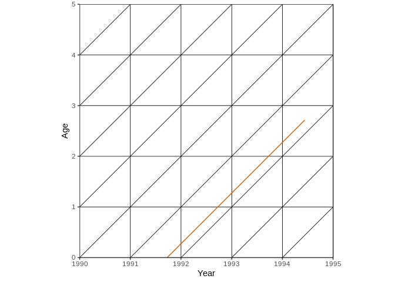

``` r
# Highlight the cohort 1898
lexis.cohort(lg = mylexis, cohort = 1898)
```

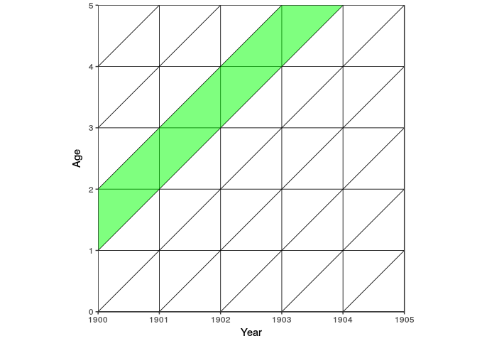

Again, fill colour and the level of transparency can be altered:

``` r
# Highlight the year 1902, change fill colour to "orange" and increase transparency
lexis.year(lg = mylexis, year = 1902, fill = "orange", alpha = 0.2)
```


``` r
# Highlight the cohort 1898, change fill colour to "grey" and decrease transparency
lexis.cohort(lg = mylexis, cohort = 1898, fill = "grey", alpha = 0.8)
```

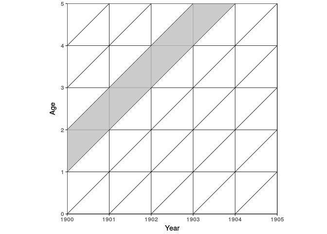

From v0.3.1 on, `lexis.survey()` is part of **`LexisPlotR`**. With `lexis.survey()`, one can sketch the progress of a survey or the like.

``` r
mylexis <- lexis.survey(lg = mylexis, from_date = "1901-06-01", to_date = "1902-12-31", from_age = 1, to_age = 3)
mylexis
```

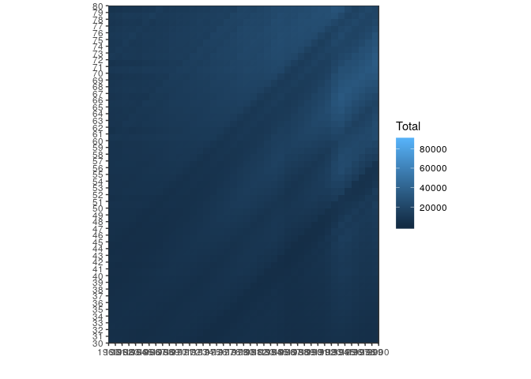

To add more than one layer or to make changes permanent you have to overwrite your Lexis object:

``` r
mylexis <- lexis.grid2(year.start = 1900, year.end = 1905, age.start = 0, age.end = 5)
```

    ## Warning: Ignoring unknown aesthetics: x, y

``` r
mylexis <- lexis.age(lg = mylexis, age = 2)
mylexis <- lexis.year(lg = mylexis, year = 1903)
mylexis <- lexis.cohort(lg = mylexis, cohort = 1898)
mylexis
```

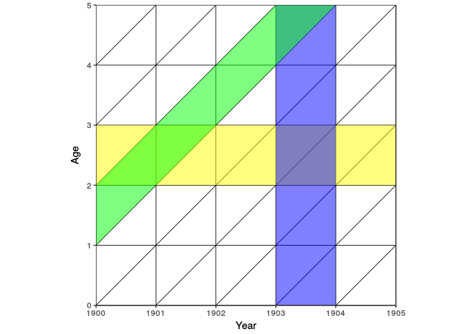

### Add life lines to the Lexis Diagram

A life line is a simple tool to represent an individual's life in a Lexis Diagram. The life line is a straight line and starts with the individual's birth at the respective point on the horizontal axis. The line ends with an individual's death (if observed).

To draw an arbitrary life line into your Lexis Diagram you use `lexis.lifeline()` and provide at least an entry or birth date to the function. If death is not observed or the date of death unknown, `exit` is `NA` resulting in a never ending life line.

``` r
# Define a Lexis grid
mylexis <- lexis.grid2(year.start = 1990, year.end = 1995, age.start = 0, age.end = 5)
```

    ## Warning: Ignoring unknown aesthetics: x, y

``` r
# Add a life line for an individual born on 1991-09-23
lexis.lifeline(lg = mylexis, entry = "1991-09-23")
```

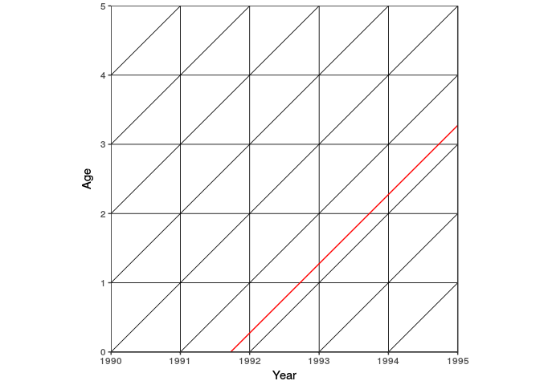

If death or any other date that can serve as an "exit" is observed, you can add the exit date:

``` r
lexis.lifeline(lg = mylexis, entry = "1991-09-23", exit = "1994-06-11")
```


You can also use entry and death dates from a `data.frame` which is useful when plotting life lines of several individuals or hole populations. **`LexisPlotR`** comes with a random dataset of entry and exit dates for 300 Individuals from 1895 to 1905. Some of the deaths (or exits) are not observed or unknown. Take a look at the `lifelines_sample` dataset:

``` r
data("lifelines_sample")
str(lifelines_sample)
```

    ## 'data.frame':    300 obs. of  2 variables:
    ##  $ entry: Date, format: "1898-04-25" "1899-12-28" ...
    ##  $ exit : Date, format: "1898-07-30" NA ...

``` r
head(lifelines_sample, 10)
```

    ##         entry       exit
    ## 1  1898-04-25 1898-07-30
    ## 2  1899-12-28       <NA>
    ## 3  1903-01-15       <NA>
    ## 4  1901-04-13       <NA>
    ## 5  1895-05-30 1900-03-29
    ## 6  1897-09-22       <NA>
    ## 7  1896-02-16 1896-04-24
    ## 8  1896-11-13 1902-10-30
    ## 9  1904-10-31       <NA>
    ## 10 1899-04-02 1902-04-11

To add all this data to your Lexis Diagram, use `lexis.lifeline()` and provide the respective columns of `lifelines_sample` as arguments:

``` r
mylexis <- lexis.grid2(year.start = 1900, year.end = 1905, age.start = 0, age.end = 5)
```

    ## Warning: Ignoring unknown aesthetics: x, y

``` r
lexis.lifeline(lg = mylexis, entry = lifelines_sample$entry, exit = lifelines_sample$exit)
```

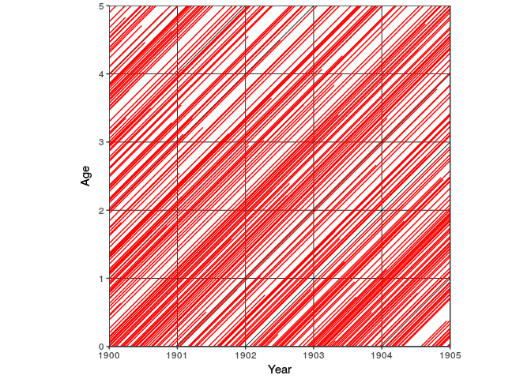

As this is just random data the plot is not really interesting and confusing. But you can change the default plotting behaviour and add marks to the lineends, change the colour and width of the lines as well as the level of transparency of the lines:

``` r
lexis.lifeline(lg = mylexis, entry = lifelines_sample$entry, exit = lifelines_sample$exit, lineends = TRUE, colour = "blue", lwd = 1.5, alpha = 0.3)
```

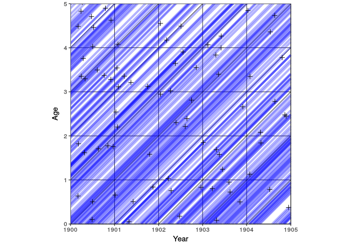

### Use data from the Human Mortality Database

> I recommend to use the actually deprecated `lexis.grid()` insted of `lexis.grid2()` when working with HMD data. I will fix this soon.

> The Human Mortality Database (HMD) contains original calculations of death rates and life tables for national populations (countries or areas), as well as the input data used in constructing those tables. The input data consist of death counts from vital statistics, plus census counts, birth counts, and population estimates from various sources. <http://www.mortality.org/Public/Overview.php>

To access data from the [HMD](http://www.mortality.org/) you first have to [register for free](http://www.mortality.org/mp/auth.pl).

The type of data we want to use here are the "Deaths by Lexis triangles" you can download for a couple of countries. These datafiles contain death counts for every year, age and cohort and so every row of these datafiles represents one of the triangles in the Lexis Diagram. The function `lexis.hmd()` takes these death counts and the respective triangles according to a gradient scale.

First you have to download a "Deaths by Lexis triangles" file from the HMD. Alternatively you can use the sample data (`Deaths_lexis_sample.txt`) that ships with `LexisPlotR`. This raw dataset includes random deaths counts but emulates the structure of the HMD datafiles.

To load and prepare the HMD data for further usage, LexisPlotR ships with `prepare.hmd()` which reads the raw data from the `.txt` file and does some preparation.

``` r
# Find the path to the sample data
path <- system.file("extdata", "Deaths_lexis_sample.txt", package = "LexisPlotR")
# read the raw data with prepare.hmd()
mydata <- prepare.hmd(path)
```

    ## Warning in prepare.hmd(path): NAs durch Umwandlung erzeugt

``` r
# Inspect your data
str(mydata)
```

    ## 'data.frame':    4400 obs. of  13 variables:
    ##  $ Year  : num  1970 1970 1970 1970 1970 1970 1970 1970 1970 1970 ...
    ##  $ Age   : num  0 0 1 1 2 2 3 3 4 4 ...
    ##  $ Cohort: num  1970 1969 1969 1968 1968 ...
    ##  $ Female: int  473 367 151 273 721 564 819 421 674 290 ...
    ##  $ Male  : int  137 55 889 184 640 379 5 52 67 784 ...
    ##  $ Total : int  610 422 1040 457 1361 943 824 473 741 1074 ...
    ##  $ upper : logi  FALSE TRUE FALSE TRUE FALSE TRUE ...
    ##  $ x1    : Date, format: "1970-01-01" "1970-01-01" ...
    ##  $ x2    : Date, format: "1971-01-01" "1970-01-01" ...
    ##  $ x3    : Date, format: "1971-01-01" "1971-01-01" ...
    ##  $ y1    : num  0 0 1 1 2 2 3 3 4 4 ...
    ##  $ y2    : num  0 1 1 2 2 3 3 4 4 5 ...
    ##  $ y3    : num  1 1 2 2 3 3 4 4 5 5 ...

``` r
summary(mydata[,c("Year", "Age", "Cohort")])
```

    ##       Year           Age            Cohort    
    ##  Min.   :1970   Min.   :  0.0   Min.   :1860  
    ##  1st Qu.:1975   1st Qu.: 27.0   1st Qu.:1897  
    ##  Median :1980   Median : 54.5   Median :1924  
    ##  Mean   :1980   Mean   : 54.5   Mean   :1924  
    ##  3rd Qu.:1984   3rd Qu.: 82.0   3rd Qu.:1952  
    ##  Max.   :1989   Max.   :109.0   Max.   :1989

As you see from `summary()` this datafile contains death counts from 1970 to 1989 for the ages 0 to 109. In a Lexis grid with suitable dimensions these death counts can be plotted. You may choose whether to plot total death counts or death counts for females or males.

``` r
mylexis <- lexis.grid(year.start = 1980, year.end = 1985, age.start = 0, age.end = 5)
# Plot total death counts
lexis.hmd(lg = mylexis, hmd.data = mydata, column = "Total")
```

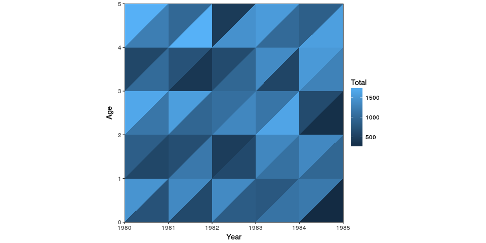

Again, this is just random data. For real insights use data from the HMD.

The HMD datafiles offer the following death counts: Total, Female and Male. If you want to plot the ratio of males on total death counts, you first have to add a respective column:

``` r
mydata$ratioMales <- mydata$Male / mydata$Total
lexis.hmd(lg = mylexis, hmd.data = mydata, column = "ratioMales")
```

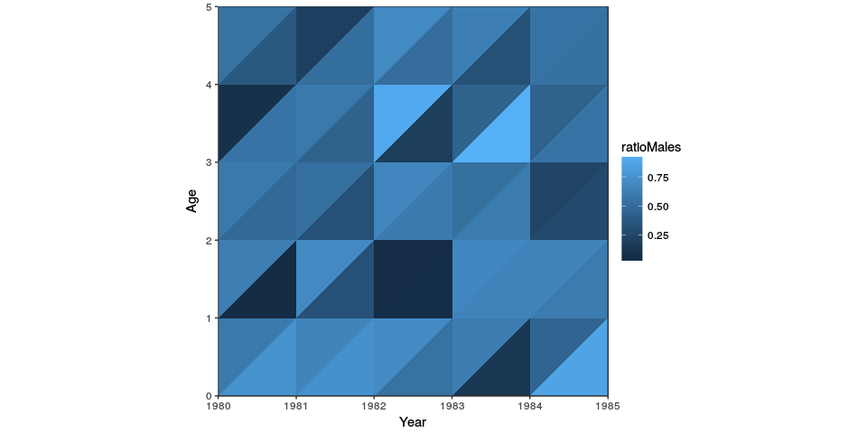

Everything is a ggplot2 object
------------------------------

**`LexisPlotR`** is simply a specialised wrapper for `ggplot2`. Therefore you can edit the appearance of your Lexis Diagram by adding some `labs` and `themes` just like with any other `ggplot2` plot.

``` r
mylexis <- lexis.grid(year.start = 1900, year.end = 1905, age.start = 0, age.end = 5)
# Add a title
mylexis <- mylexis + labs(title = "LexisPlotR")
mylexis
```

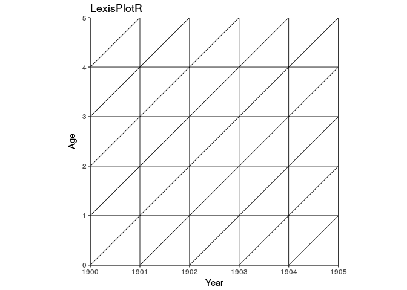

``` r
# Change axis labels
mylexis <- mylexis + theme(axis.title = element_text(face = "bold", colour = "red"))
mylexis
```

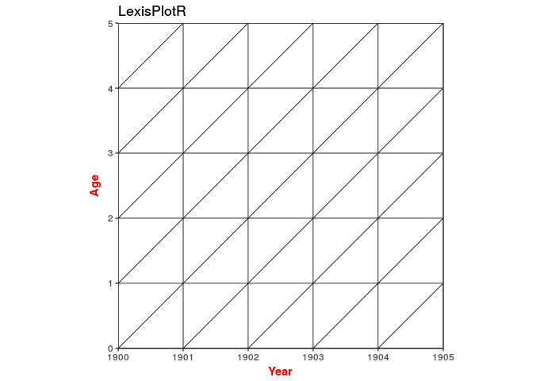

If you ...
----------

... are missing some functionality, have some ideas how to improve this package or even want to contribute, open an issue here on GitHub or contact me.
