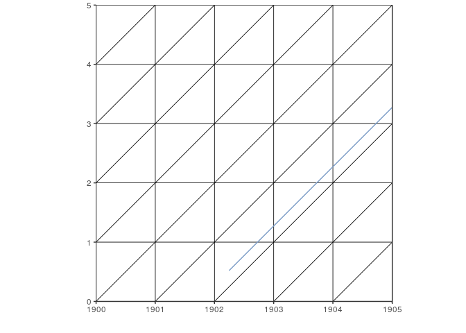
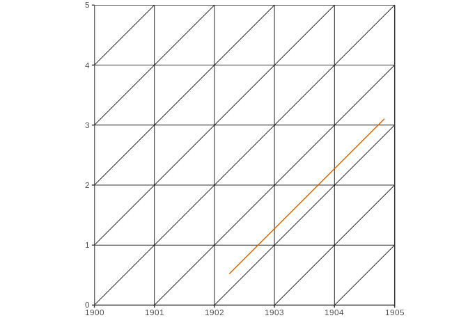

<!-- README.md is generated from README.Rmd. Please edit that file -->
LexisPlotR
==========

[](http://cran.rstudio.com/package=LexisPlotR) [](http://www.r-pkg.org/pkg/LexisPlotR)

`LexisPlotR` is a tool to easily plot Lexis Diagrams within R. It is based on [`ggplot2`](https://github.com/hadley/ggplot2) and wraps necessary steps like drawing the grid, highlighting certain areas or inserting lifelines in a couple of easy to use functions.

### What is a Lexis Diagram?

> In demography a Lexis diagram (named after economist and social scientist Wilhelm Lexis) is a two dimensional diagram that is used to represent events (such as births or deaths) that occur to individuals belonging to different cohorts. Calendar time is usually represented on the horizontal axis, while age is represented on the vertical axis. (<https://en.wikipedia.org/wiki/Lexis_diagram>)

### Major changes from v0.3.\* to v0.4

With v0.4 a complete rewrite of `LexisPlotR` started. To prevent existing code from failing, v0.4 still keeps functions from earlier versions, but only introduces new functionality in functions named using 'snake\_case'. So if you are new to `LexisPlotR` do not use functions named using dot notation (e.g. `lexis.grid()`) but functions using snake\_case (e.g. `lexis_grid()`). If you have existing code using functions from earlier versions of `LexisPlotR` please adapt new function names and syntax where necessary.

### Installation

You can install the latest version of **`LexisPlotR`** by using `install_github()` from the `devtools`-package:

    devtools::install_github("ottlngr/LexisPlotR")
    library(LexisPlotR)

`LexisPlotR` (v0.4) is available on CRAN. Install v0.4 from CRAN:

    install.packages("LexisPlotR")

### Using LexisPlotR

`LexisPlotR` provides a couple of functions to draw Lexis Diagrams in R. Besides the ability to draw empty Lexis grids, `LexisPlotR` also offers some functionality to highlight certain areas of the grid or to add actual data to the Lexis Diagram.

##### Plot an empty Lexis grid

A Lexis Diagram is basically determined by two measures: A range of years presented on the horizontal axis and a range of ages shown on the vertical axis. To plot an empty Lexis grid, use `lexis.grid()` which takes these measures as numeric inputs:

``` r
library(LexisPlotR)
```

``` r
# Plot a Lexis grid from year 1900 to year 1905, representing the ages from 0 to 5
lexis_grid(year_start = 1900, year_end = 1905, age_start = 0, age_end = 5)
```


The aspect ratio of the axes is fixed to ensure right-angled triangles. So even non-square Lexis grids show right-angled triangles:

``` r
lexis_grid(year_start = 1900, year_end = 1905, age_start = 0, age_end = 7)
```


When using wide age and/or date ranges, it may be helpful to define a `delta` specifying the number of years to group in the grid:

``` r
lexis_grid(year_start = 1900, year_end = 1950, age_start = 0, age_end = 50, delta = 5)
```


##### Highlight certain areas of the Lexis grid

Sometimes it is useful to highlight certain areas in the Lexis Diagram, like a certain age, year or cohort.

Highlighting a certain age in your grid is supported by `lexis_age` which will draw a coloured rectangle inside your grid marking all points in the grid belonging to a certain age group.

``` r
lexis <- lexis_grid(year_start = 1900, year_end = 1905, age_start = 0, age_end = 5)
lexis_age(lg = lexis, age = 2)
```


Next to `lexis_age()` there are also `lexis_year()` and `lexis_cohort()` which highlight a certain year or cohort, respectively:

``` r
lexis <- lexis_grid(year_start = 1900, year_end = 1905, age_start = 0, age_end = 5)
lexis_year(lg = lexis, year = 1903)
```


``` r
lexis <- lexis_grid(year_start = 1900, year_end = 1905, age_start = 0, age_end = 5)
lexis_cohort(lg = lexis, cohort = 1898)
```


The similar `lexis_polygon()` can be used to highlight arbitrary regions of the Lexis grid:

``` r
lexis <- lexis_grid(year_start = 1900, year_end = 1905, age_start = 0, age_end = 5)

polygons <- data.frame(group = c(1, 1, 1, 2, 2, 2),
                       x = c("1901-01-01", "1902-01-01", "1902-01-01", "1903-01-01", "1904-01-01", "1904-01-01"),
                       y = c(1, 1, 2, 1, 1, 2))

lexis_polygon(lg = lexis, x = polygons$x, y = polygons$y, group = polygons$group)
```


##### Add life lines to the Lexis Diagram

A life line is a simple tool to represent an individual's life in a Lexis Diagram.

The behaviour of `lexis_lifeline()` can be controlled by supplying an entry and/or exit date along with the individuals birthday:

``` r
lg <- lexis_grid(year_start = 1900, year_end = 1905, age_start = 0, age_end = 5)
lexis_lifeline(lg = lg, birth = "1901-09-23")
```


``` r
lexis_lifeline(lg = lg, birth = "1901-09-23", entry = "1902-04-01")
```



``` r
lexis_lifeline(lg = lg, birth = "1901-09-23", entry = "1902-04-01", exit = "1904-10-31")
```



You can also use entry and death dates from a `data.frame` which is useful when plotting life lines of several individuals or hole populations. **`LexisPlotR`** comes with a random dataset of entry and exit dates for 300 Individuals from 1895 to 1905. Some of the deaths (or exits) are not observed or unknown. Take a look at the `lifelines_sample` dataset:

``` r
data("lifelines_sample")
lifelines_sample <- lifelines_sample[1:30,]
head(lifelines_sample, 10)
```

    ##         entry       exit
    ## 1  1898-04-25 1898-07-30
    ## 2  1899-12-28       <NA>
    ## 3  1903-01-15       <NA>
    ## 4  1901-04-13       <NA>
    ## 5  1895-05-30 1900-03-29
    ## 6  1897-09-22       <NA>
    ## 7  1896-02-16 1896-04-24
    ## 8  1896-11-13 1902-10-30
    ## 9  1904-10-31       <NA>
    ## 10 1899-04-02 1902-04-11

To add all this data to your Lexis Diagram, use `lexis.lifeline()` and provide the respective columns of `lifelines_sample` as arguments:

``` r
lg <- lexis_grid(year_start = 1900, year_end = 1905, age_start = 0, age_end = 5)
lexis_lifeline(lg = lg, birth = lifelines_sample$entry, exit = lifelines_sample$exit, lineends = TRUE)
```


##### Use data from the Human Mortality Database

> I recommend to use the actually deprecated `lexis.grid()` insted of `lexis.grid2()` when working with HMD data. I will fix this soon.

> The Human Mortality Database (HMD) contains original calculations of death rates and life tables for national populations (countries or areas), as well as the input data used in constructing those tables. The input data consist of death counts from vital statistics, plus census counts, birth counts, and population estimates from various sources. <http://www.mortality.org/Public/Overview.php>

To access data from the [HMD](http://www.mortality.org/) you first have to [register for free](http://www.mortality.org/mp/auth.pl).

The type of data we want to use here are the "Deaths by Lexis triangles" you can download for a couple of countries. These datafiles contain death counts for every year, age and cohort and so every row of these datafiles represents one of the triangles in the Lexis Diagram. The function `lexis.hmd()` takes these death counts and the respective triangles according to a gradient scale.

First you have to download a "Deaths by Lexis triangles" file from the HMD. Alternatively you can use the sample data (`Deaths_lexis_sample.txt`) that ships with `LexisPlotR`. This raw dataset includes random deaths counts but emulates the structure of the HMD datafiles.

To load and prepare the HMD data for further usage, LexisPlotR ships with `prepare.hmd()` which reads the raw data from the `.txt` file and does some preparation.

``` r
# # Find the path to the sample data
# path <- system.file("extdata", "Deaths_lexis_sample.txt", package = "LexisPlotR")
# # read the raw data with prepare.hmd()
# mydata <- prepare.hmd(path)
# # Inspect your data
# str(mydata)
# summary(mydata[,c("Year", "Age", "Cohort")])
```

As you see from `summary()` this datafile contains death counts from 1970 to 1989 for the ages 0 to 109. In a Lexis grid with suitable dimensions these death counts can be plotted. You may choose whether to plot total death counts or death counts for females or males.

``` r
# mylexis <- lexis.grid(year.start = 1980, year.end = 1985, age.start = 0, age.end = 5)
# # Plot total death counts
# lexis.hmd(lg = mylexis, hmd.data = mydata, column = "Total")
```

Again, this is just random data. For real insights use data from the HMD.

The HMD datafiles offer the following death counts: Total, Female and Male. If you want to plot the ratio of males on total death counts, you first have to add a respective column:

``` r
# mydata$ratioMales <- mydata$Male / mydata$Total
# lexis.hmd(lg = mylexis, hmd.data = mydata, column = "ratioMales")
```

##### Everything is a ggplot2 object

**`LexisPlotR`** is simply a specialised wrapper for `ggplot2`. Therefore you can edit the appearance of your Lexis Diagram by adding some `labs` and `themes` just like with any other `ggplot2` plot.

``` r
# mylexis <- lexis.grid(year.start = 1900, year.end = 1905, age.start = 0, age.end = 5)
# # Add a title
# mylexis <- mylexis + labs(title = "LexisPlotR")
# mylexis
# # Change axis labels
# mylexis <- mylexis + theme(axis.title = element_text(face = "bold", colour = "red"))
# mylexis
```

### If you ...

... are missing some functionality, have some ideas how to improve this package or even want to contribute, open an issue here on GitHub or contact me.
